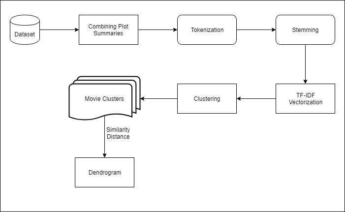
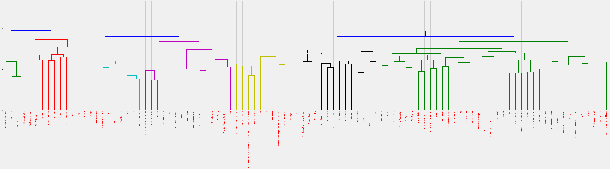

# Carbon Movies
Carbon Movies is a project aimed to cluster movies using their Plot Summaries from IMDb and Wikipedia. The Dataset currently has 100 movies which can be further extended to other languages and genres.

## Architecture of the project

## Output

